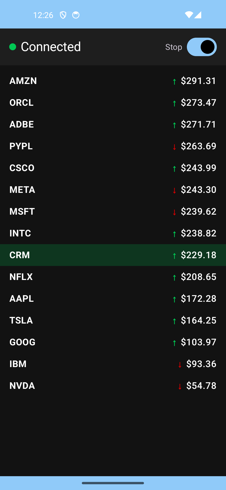

# 📈 Price Tracker App  
Real-time stock price updates using **WebSocket**, **Jetpack Compose**, **Clean Architecture**, **MVI-like state management**, and **Kotlin Flow**.

This project was built as part of an Android coding challenge.

---

## 🖼️ Screenshots  

<div align="center">

### 🌞 Light Mode  


### 🌙 Dark Mode  


</div>

---

## 🎞️ Demo GIF

<div align="center">


</div>

---

# 🚀 Features

### 🔌 Real-time WebSocket Price Stream  
- Connects to: `wss://ws.postman-echo.com/raw`  
- Sends simulated stock prices → server echoes them back.  
- ViewModel converts the stream into sorted UI list.

### 📊 Sorted Stock List  
- Always shows prices in **descending** order (highest at top).  
- Automatically updates as new prices arrive.

### 🎨 Price Change Indicators  
- Green **↑** for price increase  
- Red **↓** for price decrease  
- Gray **→** for flat  
- 1-second background flash (green/red)

### 🌗 Light & Dark Themes (Material 3)  
- System dark mode support  
- Custom color palettes  
- Dynamic status bar & nav bar coloring

### 🧱 Clean Architecture  
- **data** → WebSocket data source + repository  
- **domain** → immutable models  
- **ui** → ViewModel + Compose screens  
- Single source of truth using **StateFlow**

### 🧪 Unit Tests  
- Tests ensure:
  - Start/Stop connection logic  
  - Sorted price list  
  - Previous price tracking  
  - Flow → ViewModel state propagation  
- Includes coroutine test dispatcher rule  
- FakeRepository for deterministic behavior

---

# 📁 Project Structure

```
app/
 ├── data/
 │    ├── websocket/
 │    │      PriceWebSocketDataSource.kt
 │    ├── repository/
 │    │      PriceRepositoryImpl.kt
 │    └── model/
 │           PriceUpdateDto.kt
 │
 ├── domain/
 │    ├── model/
 │    │      PriceItem.kt
 │    └── repository/
 │           PriceRepository.kt
 │
 ├── ui/
 │      PriceScreen.kt
 │      PriceViewModel.kt
 │      PriceViewModelFactory.kt
 │      PriceUiState.kt
 │      PriceUiEvent.kt
 │
 │    └── theme/
 │           Color.kt
 │           Theme.kt
 │           Shape.kt
 │
 ├── MainActivity.kt
 └── README.md
```

---

# 🏗️ Architecture Overview

This project uses a **lightweight MVI approach**:

### **State (Model)**  
`PriceUiState` is immutable and contains:

```
isConnected  
isStreaming  
prices: List<PriceItem>  
errorMessage  
```

### **Events (Intent)**  
User actions → `PriceUiEvent`

```
StartClicked  
StopClicked  
```

### **Business Logic (ViewModel)**  
- Starts/stops the WebSocket stream  
- Maps `Flow<Map<String, PriceItem>>` → sorted price list  
- Emits new `PriceUiState` values via `StateFlow`

### **UI (Compose)**  
- Collects `StateFlow`  
- Updates list, connection status, buttons & indicators  

---

# 🔧 WebSocket Implementation

Using **OkHttp WebSocket**:

- Connect to: `wss://ws.postman-echo.com/raw`
- Send random messages like `"AAPL;123.45"`
- Server echoes raw text back
- Parse into `PriceUpdateDto`  
- Convert to `PriceItem`  
- Emit to UI

---

# 🧪 Testing

Tests located in:

```
app/src/test/java/com/example/pricetracker/
```

Includes:

### ✔ `PriceViewModelTest`
- stream starts/stops correctly  
- prices sorted descending  
- previousPrice preserved  
- flow emissions propagate to state  

### ✔ Test utilities  
- `MainDispatcherRule`  
- `FakePriceRepository(replay = 1)`  

Run all tests:

```
./gradlew test
```

---

# ▶️ How to Run

1. Clone repository  
   ```bash
   git clone https://github.com/your-username/price-tracker
   ```
2. Open in **Android Studio**  
3. Ensure AndroidManifest has:  
   ```xml
   <uses-permission android:name="android.permission.INTERNET" />
   ```
4. Run the app on emulator or device  
   - Tap **Start** to begin streaming  
   - Tap **Stop** to disconnect  

---

# 📦 Requirements

- Kotlin 1.9+  
- Android Studio Ladybug or newer  
- Min SDK 24  
- Compose BOM 2024.x  
- OkHttp 4.12.0  
- Coroutines 1.9.0  

---


# 🙌 Credits

Created by **Brajesh Jaiswal**
